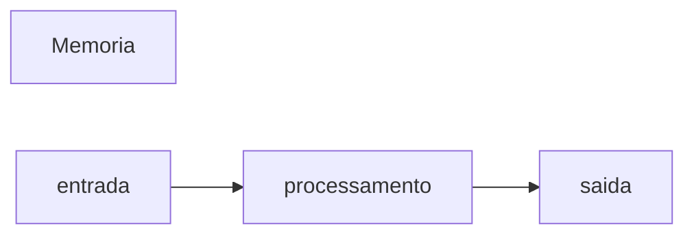

 # javascript
 Repositorio usado para estudo da logica de programção 
 
 ## Autor
 Jhoseline aydee

 ---
##variaveis são espaços na menoria do computador usados para guardar valores que podem alterar ao longo do programa
### Principais tipos primitivos:
- strings(textos)
- number(numero que são inteiros )
- boolean (verdadeiro ou falso 


## Operadores Aritméticos
| Operador| Proposito| Exemplo| Resultado|
|---------|----------|--------|----------|
| = | atribuir um valor | x =10| x=10
|+ |somar|10+5|15|
|+= |somar e atribuir | x+=5| x=15|
|- |subtrair|15 - 10| 5 |
|-= |subtrair e atribuir |x-=10|x=5|
|* | multiplicar |5*4|20|
|*= |multiplicar e atribuir |x*=4|x=20|
|/ |dividir|20 - 10/ 2 | 10|
|/= |dividir e atribuir| x/=2|10|
|++|somar 1 ao resultado|x++|11|
|--|subtrair  1 do resultado|x--|10|
|%|resto da divisao|10%3|1|

## operadores logicos 

| Operadores  | Simbologia |
|-------------|------------|
| AND |&& |
|OR  | \|\| |
|NOT  | ! |


## Comparadores
| Comparador | Significado |
|-------------|------------|
|>      | maior que |
|>=     |maior ou igual|
|<      |menor que |
|<=     |  menor ou igual a|
|===    |identico a |
|!==    |não identico a|


## estruturas de controle 
### estruturas de controle condicionais
``` javascript
if (condicão){
// condição verdadeira
}


if (consição ){
//condiççao verdadeira
} else {
// condição falsa
}

```

|

