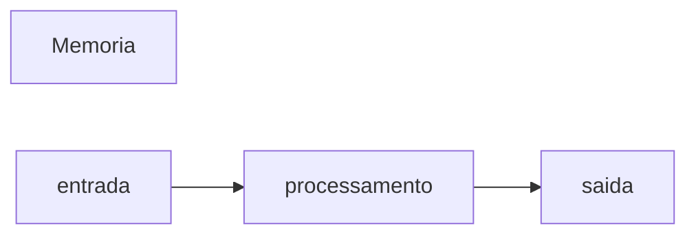

 # javascript
 Repositorio usado para estudo da logica de programção 
 
 ## Autor
 Jhoseline aydee

 ---
##variaveis são espaços na menoria do computador usados para guardar valores que podem alterar ao longo do programa
### Principais tipos primitivos:
- strings(textos)
- number(numero que são inteiros )
- boolean (verdadeiro ou falso 

## operadores Aritimeticos
| Operador| Proposito| Exemplo| Resultado|
|---------|----------|--------|----------|
| = | atribuir um valor | x =10| x=10
|+ |somar|10+5|15|
|+= |somar e atribuir | x+=5| x=15|
